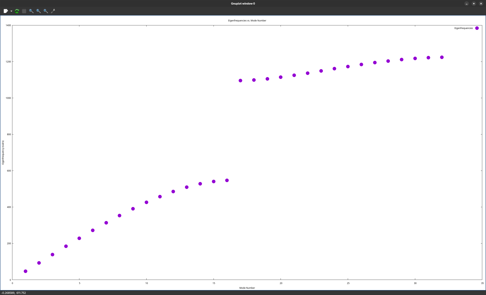

# loaded-string-simulator


loaded-string-simulator is a physics simulator that can simulate loaded strings
and mass-spring coupled oscillators. It uses the GNU Scientific Library (GSL)
for computation and gnuplot to generate plots.

## Compiling

Ensure GSL, libgsl-devel, and gnuplot are installed. If you want to generate
gifs, install either ffmpeg or imagemagick and enable the appropriate option for
GIFFLAGS in the makefile. Then run

```bash
make
```

Change #define statements in plot.c to change the appearance of plots.

## Usage

Setup simulation parameters, following the pattern in either
examples/examplestringsetup.txt or examples/examplespringsetup.txt.

Then run

```bash
./simulate [OPTIONS] [FILE]
```

### Options
-p, --print  
prints eigenfrequencies, eigenvectors, and mode amplitudes in terminal  

-e, --eigenfrequencies  
plots eigenfrequencies  

-a, --amplitudes 
plots mode amplitudes  

-m, --modes  
plots individual normal modes  

-s, --simulate [TIME\_SCALE] 
animates the simulation at a speed TIME\_SCALE x real speed. TIME\_SCALE defaults to 1.0 if unspecified  

-g, --gif 
only use following -s option. Saves animation as a .gif  

-p option is used if no options specified

## Examples

### Band Gap


### Mode Amplitudes


### Individual Normal Modes


### Wave Propagation


### Coupled Springs


## Licensing

This project is licensed under the
[GPLv3](https://choosealicense.com/licenses/gpl-3.0/).
